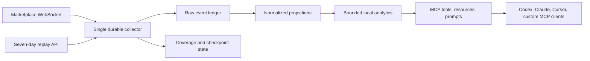
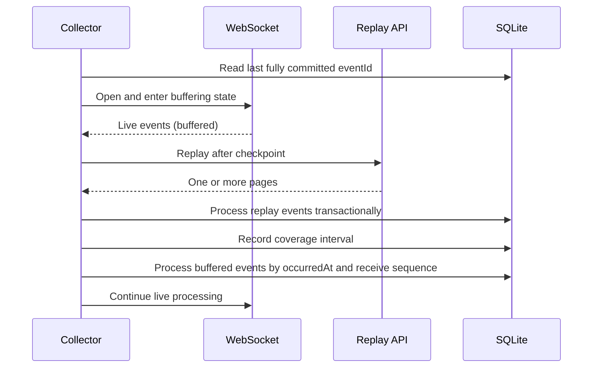

# Architecture

The process has one upstream collector and one local query layer:

## Components

- `src/domain` validates versioned envelopes, preserves unknown fields and event types, and performs exact decimal arithmetic.
- `src/ingest` owns replay pagination, WebSocket buffering, reconnect backoff, cursor expiry, and message diagnostics.
- `src/storage` owns migrations, prepared statements, raw event persistence, checkpoints, projections, coverage intervals, and local alerts.
- `src/analytics` computes bounded summaries and deterministic screens from local data only.
- `src/mcp` is the presentation boundary. It does not open an upstream connection per request.
- `src/transport` serves stdio by default and optional guarded Streamable HTTP.

## Recovery lifecycle

If the cursor is expired, the collector records a gap covering the unproven interval, restarts replay without a cursor, and exposes the discontinuity in health and result envelopes. A cursor is advanced only inside the same transaction that marks the raw event processed and applies its projection.

## Transaction boundary

For each event, `EventRepository.processEvent` inserts or replaces the raw row as `failed`, runs projections and alert-hit persistence, marks the row `processed`, advances the checkpoint, and updates collector counters in one SQLite transaction. A projection exception rolls back all of those writes; a separate failure record preserves a safe diagnostic row without advancing the checkpoint.

Unknown event types follow the same transaction. They are stored as raw events, counted, checkpointed, and skipped by projections. Known event schemas retain additive fields for forward compatibility while projections read only fields they understand.

## Storage model

SQLite runs with WAL mode, foreign keys, a busy timeout, and migrations. Raw payloads remain available for provenance and future projection changes. Normalized tables are intentionally observations: the upstream contract has no stable `listing_id`, and the project does not manufacture one.
